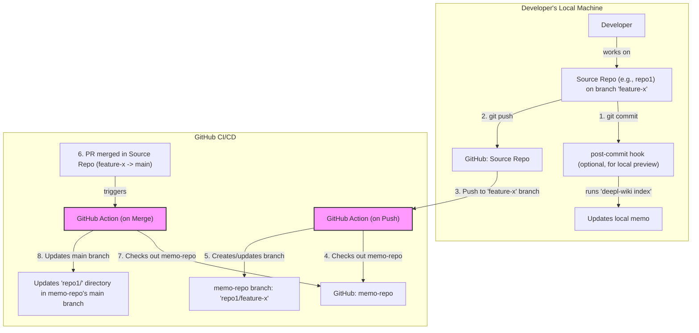

# Project: `deepl-wiki` - Setup and Usage Instructions

This document outlines the steps for a user to install, configure, and use the `deepl-wiki` tool to generate and interact with documentation for their software projects.

---

### Architecture Overview

The `deepl-wiki` tool facilitates a centralized documentation model where multiple source code repositories have their documentation ("Memos") stored and versioned in a single, central "memo" repository on GitHub.

This architecture relies on GitHub Actions to automate the documentation lifecycle. When developers push changes to their repositories, a corresponding branch is created in the memo repository. When a pull request is merged, the main documentation in the memo repository is updated.

*   **CLI**: Python (`pip` installable) for local commands like `init` and `index`.
*   **AI Model**: Llama 4 API (requires user-provided API key).
*   **Central Documentation**: A dedicated GitHub repository (the "memo-repo") stores all generated documentation.
*   **Automation**: GitHub Actions within each source repository manage the process of updating the memo-repo.
*   **Frontend**: Next.js (served locally via `deepl-wiki serve`) to view docs and chat with the codebase.

### The Documentation Workflow

Here is a diagram illustrating the flow of information from a developer's commit to the final documentation update:



---

### 1. Prerequisites

Before you begin, ensure you have the following installed:

*   Python (3.8 or higher) and pip
*   Git
*   GitHub CLI (`gh`). You must be logged in (`gh auth login`).

---

### 2. Installation

Install `deepl-wiki` from PyPI:

```bash
pip install deepl-wiki
```

---

### 3. Project Initialization (`init`)

The `init` command sets up a new documentation project in the current directory.

```bash
deepl-wiki init
```

This command starts an interactive setup wizard:

1.  **Repository Selection**: It fetches a list of your GitHub repositories and asks you to select which ones to include for documentation.
2.  **Memo Repository**: It asks for the name of the central GitHub repository to store the "memos". This repo will contain the documentation for all selected source repositories, organized into subdirectories.
3.  **Automatic Updates**: It asks if you want to automatically update documentation. If yes, it will guide you through creating the necessary GitHub Actions workflow files in the selected repositories. These workflows will handle pushing documentation updates to the memo-repo.
4.  **File Generation**: The wizard creates:
    *   `deepl-wiki.settings.json`: The main configuration file for your project.
    *   `.env`: A file for your secret API key.
5.  **API Key Prompt**: It will instruct you to add your Llama 4 API key to the `.env` file.

---

### 4. Indexing Content (`index`)

The `index` command is typically run within the GitHub Actions workflow, but can also be run locally to generate or update the documentation for a repository.

```bash
deepl-wiki index
```

This command will:
1.  Clone or pull the latest code from the selected repositories.
2.  Invoke the **Documentation Agent** to:
    *   Generate a human-readable **Docs Wiki** in a `docs/` folder within each repository (optional).
    *   Generate a context-rich **Memo** for the AI agent.
3.  The GitHub Action then pushes the generated Memo to the appropriate branch and directory in the central memo repository.
4.  When running `serve`, vector embeddings of all content are created and stored in a local ChromaDB instance.

---

### 5. Serving the Docs (`serve`)

To view the documentation and chat with your codebase, run:

```bash
deepl-wiki serve
```

This command pulls the latest documentation from your central memo repository, starts a local web server, and allows you to browse the docs and use the chat interface.